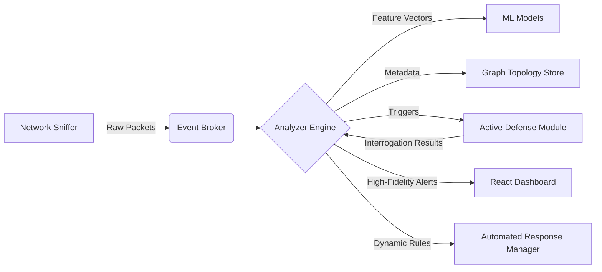

# Shadow Hunter

**Active Defense System for Shadow AI and Lateral Movement Detection**

## Overview

Shadow Hunter is an enterprise-grade Active Defense System built to combat the rising threat of Shadow AI—the covert, unsanctioned use of Generative AI tools and potential data exfiltration within an organization. 

Moving beyond passive monitoring systems that rely on easily bypassed blocklists, Shadow Hunter acts as an **Active Sensor**. It employs a multi-layered machine learning approach to detect encrypted AI traffic patterns in real-time, subsequently deploying active interrogation techniques to verify threats and neutralize communication channels automatically.

## Executive Summary for Judges

Traditional firewalls and SIEMs are blind to modern, encrypted lateral movement and unauthorized AI usage because they primarily inspect static headers or IP addresses. Shadow Hunter introduces three critical innovations:

1. **Active Interrogation over Passive Logging:** Instead of simply logging an anomaly, the system probes the suspect connection directly to confirm if it belongs to an AI service or command-and-control server, reducing false positives to near zero.
2. **Cryptographic Identity Verification (JA3):** Client spoofing is defeated by fingerprinting the actual TLS handshake. If a Python script or malware mimics a legitimate browser header, Shadow Hunter immediately flags the discrepancy.
3. **Graph-Based Threat Topologies:** Network traffic is modeled as a real-time Force-Directed Graph. By calculating Betweenness Centrality, the system identifies internal machines acting as covert bridges for data exfiltration.

## Key Scenarios & Examples

### Scenario 1: Unauthorized Data Exfiltration via Public LLMs
* **The Threat:** An employee attempts to upload sensitive proprietary source code to a public LLM via a corporate endpoint.
* **The Detection:** The Multi-Layer AI Engine (Isolation Forest and Deep Autoencoder) detects anomalous payload sizes and timing intervals characteristic of an LLM query, bypassing standard HTTPS whitelists.
* **The Response:** Shadow Hunter isolates the connection, alerts the administrative dashboard, and dynamically drops the packets preventing intellectual property loss.

### Scenario 2: Sophisticated Malware Client Spoofing
* **The Threat:** A malicious script executes on an internal server, establishing an outbound C2 connection while faking a `User-Agent: Mozilla/5.0` header to blend in.
* **The Detection:** Shadow Hunter extracts the JA3 TLS fingerprint and compares it to known browser signatures. It instantly identifies the cryptographic mismatch between the claimed browser and the actual TLS client hello.
* **The Response:** The anomalous node is highlighted on the 3D topology graph, and the Auto-Remediation engine immediately blocks the IP.

## System Architecture

Shadow Hunter is engineered with a modular, microservices-inspired architecture running as a high-performance monolith.



## Core Capabilities

### 1. Advanced Machine Learning Engine
We utilize a triad of specialized models to ensure comprehensive coverage:
* **Isolation Forest:** Identifies statistical outliers in packet timing and size distributions.
* **Random Forest Classifier:** Categorizes traffic flows into normal, suspicious, or known Shadow AI patterns.
* **Deep Autoencoders:** Reconstructs traffic patterns to detect zero-day behavioral deviations.

### 2. Active Defense Mechanisms
* **JA3 TLS Fingerprinting:** Validates client software legitimacy via cryptographic handshakes rather than relying on easily spoofed headers.
* **Active Interrogation:** Deploys harmless HTTP probes (`OPTIONS`, `HEAD`) to evaluate and identify external target endpoints without disrupting legitimate network traffic.

### 3. Automated Remediation & Visualization
* **Dynamic Firewall Integration:** Automatically severs communication with IPs scoring above a critical risk threshold.
* **3D Force-Directed Graphing:** Translates abstract network data into an interactive visual landscape to pinpoint horizontal lateral movement.
* **Smart Filtering:** Intelligently ignores background noise (e.g., DNS, Multicast) to focus computational resources on viable threats.

## Setup and Installation

### Prerequisites
* Python 3.10+
* Node.js 18+
* Npcap (Windows) or libpcap (Linux/macOS) for Live Capture

### 1. Environment Setup

```bash
git clone https://github.com/The-Cloud-Ambassadors/Shadow_hunter.git
cd Shadow_hunter

# Install Backend Dependencies
pip install -r requirements.txt

# Install Frontend Dependencies
cd services/dashboard
npm install
```

### 2. Running the Platform

**Option A: Simulation Demo (Recommended for Evaluation)**
This mode generates realistic virtual employee traffic, perfect for demonstrating capabilities without requiring a live network setup.

```bash
# Terminal 1 - Start the Backend AI Engine
python run_local.py

# Terminal 2 - Start the Dashboard
cd services/dashboard
npm run dev
```

**Option B: Live Interface Monitoring**
To monitor your actual local network interface in real-time.

```bash
python run_local.py --live
```

## Cloud Deployment

This contains the deployment artifacts used to build and deploy Shadow Hunter to
Google Cloud Run using Cloud Build and Artifact Registry.

### Build Image
Run Cloud Build (it will tag images using `${SHORT_SHA}`):

```bash
gcloud builds submit --config cloudbuild.yaml .
```

### Deploy to Cloud Run
Pass the image tag created by Cloud Build to the deploy script:

```bash
./deploy.sh <IMAGE_TAG>
```

Example (from CI):

```bash
# Cloud Build sets SHORT_SHA; use that tag for deploy
./deploy.sh ${SHORT_SHA}
```

### Setup Pub/Sub
```bash
./setup_pubsub.sh
```

### Setup Logging Sink
```bash
./setup_logging_sink.sh
```

## Dashboard Operations

The React-based dashboard is the unified command center for security analysts.
* **Graph View:** Interactive 3D visualization of the network. Nodes are color-coded logically (Internal, External, Threat).
* **Alerts Stream:** Real-time feed of detected anomalies ranked by ML confidence scores.
* **Intelligence Logs:** Live feedback from the Active Defense module detailing interrogation results.
* **Theme Support:** Fully supports Enterprise Light and Dark modes for continuous, comfortable operational viewing.

## Technology Stack
* **Backend:** Python 3.10, AsyncIO, Scapy
* **Intelligence:** Scikit-Learn (Isolation & Random Forest), PyTorch/TensorFlow
* **Frontend:** React 18, Vite, TailwindCSS
* **Data Visualization:** NetworkX, 3D Force-Graph
* **Communication:** WebSockets for millisecond-latency streaming

---
*Built for the CA Hackathon 2026. Next-generation security through Agentic AI.*
