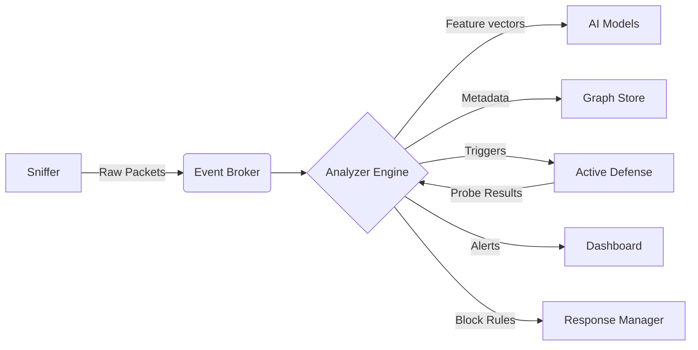

# 🦅 Shadow Hunter

**Active Defense AI for Shadow IT & Lateral Movement**

> **🚨 The Problem:** Traditional firewalls see "HTTPS traffic" to an unknown IP. They ignore it.  
> **🛡️ The Solution:** Shadow Hunter acts as an **Active Sensor**. It detects, investigates, and neutralizes Shadow AI usage and lateral movement in real-time.

---

## 📺 Demo

[](https://www.loom.com/share/YOUR_VIDEO_ID_HERE)

_(Click to watch the 5-minute Consulting Pitch & Technical Walkthrough)_

---

## 📄 Product Abstract

**Shadow Hunter** is an enterprise-grade Active Defense System designed to combat the rising threat of **Shadow AI**—the unsanctioned use of GenAI tools by employees. Unlike passive monitoring solutions that rely on outdated blocklists, Shadow Hunter employs a **Multi-Layer AI Engine** to detect encrypted AI traffic patterns (size, timing, frequency) in real-time.

Upon detection, the system transitions from passive observer to **Active Hunter**, launching probing mechanisms to cryptographically verify the destination (JA3 Fingerprinting) and the service type (Active Interrogation). This allows organizations to prevent data exfiltration and intellectual property leakage without hindering legitimate productivity.

---

## 💡 Innovativeness

1.  **Active Defense, Not Just Monitoring:** Most tools just log alerts. Shadow Hunter **interrogates** the suspect. If a connection looks like an AI API, we send a harmless probe (`HTTP OPTIONS`) to confirm it, generating high-fidelity alerts with zero false positives.
2.  **JA3 Identity Verification:** We don't trust `User-Agent` headers. We fingerprint the **TLS Handshake** itself. If a script creates a connection but claims to be "Google Chrome," our JA3 matcher detects the spoof instantly.
3.  **Graph-Based Lateral Movement Detection:** We visualize the network as a real-time **Force-Directed Graph**. By calculating **Betweenness Centrality**, we identify internal nodes acting as "bridges" or pivot points for attackers, a technique often missed by standard SIEMs.

---

## 🌍 Impact

- **Security:** Prevents the leakage of PII, API keys, and proprietary code to public LLMs (ChatGPT, Claude, etc.).
- **Compliance:** Ensures adherence to GDPR, HIPAA, and SOC2 by enforcing strict data egress policies for AI tools.
- **Visibility:** Transforms opaque network logs into a living, breathing **3D map** of the organization's digital footprint, empowering C-suite executives with immediate situational awareness.

---

## 🚀 Key Capabilities

### 1. 🧠 Multi-Layer AI Engine

We don't rely on simple blocklists. Our analysis pipeline uses three distinct models:

- **Isolation Forest**: Detects statistical anomalies in packet timing and size.
- **Random Forest**: Classifies traffic into `Normal`, `Suspicious`, or `Shadow_AI`.
- **Deep Autoencoder**: Reconstructs traffic patterns to flag zero-day deviations.

### 2. 🕵️‍♂️ Active Defense (The "Hunter")

- **JA3 Fingerprinting**: Identifies the client software. If a script pretends to be Chrome, we catch it.
- **Active Interrogation**: Sends harmless probes (`HTTP OPTIONS`, `HEAD`) to the target IP to confirm if it's an AI service.

### 3. ⚡ Auto-Remediation

- **Dynamic Firewall**: Instantly blocks IPs with a "Critical" risk score.
- **Smart Whitelisting**: Automatically ignores DNS, Gateways, and Multicast noise.

---

## 📚 Detailed Documentation

For a **grain-to-grain** breakdown of the codebase, algorithms, and database schema, please refer to the **[Definitive User Guide](docs/Shadow_Hunter_Definitive_Guide.md)**.

---

## 🏗️ Architecture

Shadow Hunter runs as a high-performance monolith for hackathons (`run_local.py`), but internally uses a microservices design:



---

## 🛠️ Quick Start

### Prerequisites

- **Python 3.10+**
- **Node.js 18+**
- **Npcap** (Windows) for Live Mode

### 1. Installation

```bash
git clone https://github.com/antigravity/shadow-hunter.git
cd shadow-hunter

# Backend
pip install -r requirements.txt

# Frontend
cd services/dashboard
npm install
```

### 2. Running the System

**Option A: Demo Mode (Recommended)**  
Runs a simulation with 5 virtual employees generating realistic traffic.

```bash
# Terminal 1
python run_local.py

# Terminal 2
cd services/dashboard && npm run dev
```

**Option B: Live Mode**  
Monitors _your_ actual network interface.

```bash
python run_local.py --live
```

---

## 📊 Dashboard Guide

| View       | Purpose                                                                               |
| :--------- | :------------------------------------------------------------------------------------ |
| **Graph**  | 3D visual of network topology. **Blue**=Internal, **Green**=External, **Red**=Threat. |
| **Alerts** | Real-time feed of detected incidents with ML confidence scores.                       |
| **Intel**  | Live logs from the Active Defense module (e.g., "Probing 1.2.3.4... Confirmed AI").   |

---

## 🛡️ Tech Stack

- **Core**: Python 3.10, AsyncIO, Scapy
- **ML**: Scikit-Learn (Isolation Forest), PyTorch/TensorFlow (Autoencoder)
- **Graph**: NetworkX, 3D Force-Graph
- **Web**: React 18, Vite, TailwindCSS, Lucide
- **Protocol**: WebSockets for real-time streaming

---

> _Built for the CA Hackathon 2026. Security meets Agentic AI._
