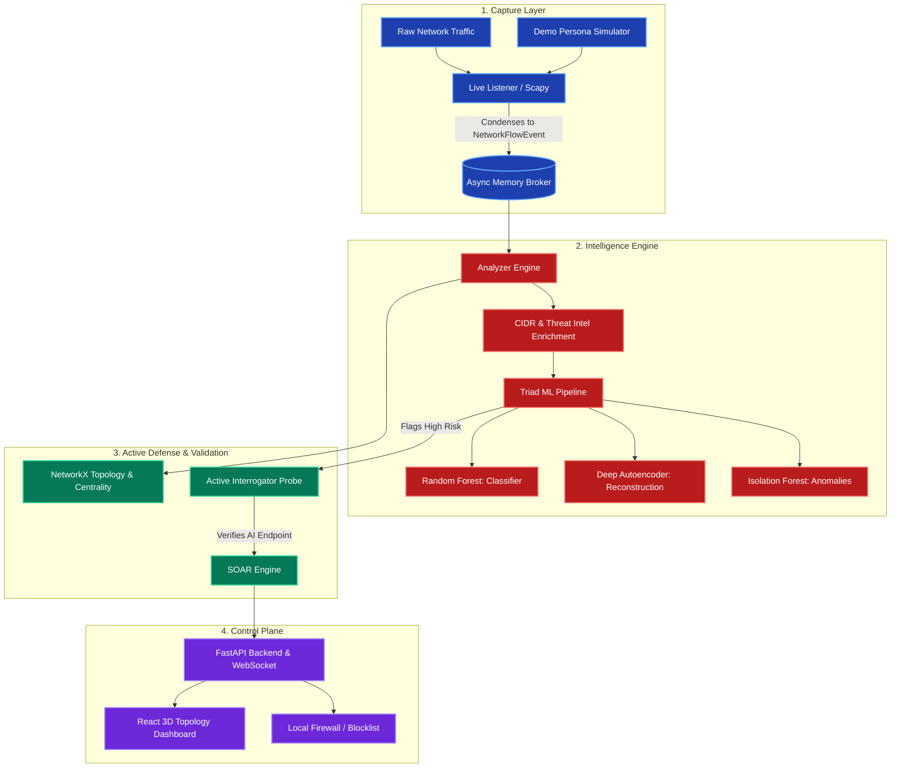

# Shadow Hunter: Hackathon Submission Abstract

This document contains the foundational content required for the **Cloud Ambassadors Vibe Coding Hackathon 2026** Google Document submission. It covers the Product Abstract, Architecture Diagram, Product Innovativeness, and the Impact of the Solution.

---

## 1. Product Abstract
**Shadow Hunter** is a real-time, AI-driven active defense cybersecurity platform specifically engineered to detect, verify, and neutralize "Shadow AI." Shadow AI refers to the unauthorized, concealed, or unvetted usage of generative AI tools (like ChatGPT, Claude, Copilot) or automated programmatic queries that standard enterprise firewalls often misclassify as benign web browsing. 

Instead of relying on easily spoofed superficial traits like HTTP headers, Shadow Hunter analyzes the deep behavioral topography and cryptographic fingerprints of network traffic. By intercepting network flow events, enriching them with threat intelligence, and passing them through a triad of machine learning models (Isolation Forest, Deep Autoencoder, Random Forest), it accurately flags anomalous semantic structures. Once flagged, the system transitions from a passive listener to an active interrogator, probing the suspicious endpoint to confirm its identity. Finally, through an integrated SOAR (Security Orchestration, Automation, and Response) mechanism, it automatically severs illicit connections, providing an interactive 3D topography dashboard for security operators to monitor enterprise health in real time.

## 2. Architecture Diagram

## 3. Product Innovativeness
Shadow Hunter pioneers a paradigm shift in how internal networks are monitored for generative AI compliance. It introduces three core innovations:
1. **Cryptographic & Behavioral Detection over Heuristics:** Traditional DLPs (Data Loss Prevention) and firewalls rely on static IP blacklists or User-Agent string matching. Shadow Hunter uses **JA3 TLS Fingerprinting** combined with feature extraction (byte ratios, packet cadence) to catch spoofed requests—for example, a Python `requests` script pretending to be a Chrome browser.
2. **Triad ML Pipeline:** It utilizes three concurrent ML models. The Deep Autoencoder is particularly innovative as it trains solely on "normal" traffic. If an employee uses a zero-day or unlisted AI tool, the high reconstruction error generated by the Autoencoder catches it, providing robust zero-day Shadow AI detection.
3. **Automated Active Interrogation:** Rather than just throwing a passive alert into a SIEM, Shadow Hunter actively issues benign probes (like `OPTIONS` requests) back to the suspicious external IP to confirm if it responds with AI-typical CORS headers, dynamically transforming a speculative ML alert into cryptographic certainty before autonomous blocking.

## 4. Impact of the Solution
For the modern enterprise, **Shadow Hunter delivers critical Commercial ROI and Risk Mitigation:**
- **Prevents IP Exfiltration:** Automatically stops employees from pasting proprietary code, client PII, or internal intellectual property into unsanctioned, public generative AI models.
- **Reduces Security Operations Costs (Engineering Productivity):** The SOAR framework and automated Active Interrogation eliminate false positives before they reach human analysts, drastically reducing alert fatigue and triage time.
- **Provides Unprecedented Visibility:** The 3D Force-Directed Graph mapping identifies internal lateral movement and pinpointing employees acting as "bridge nodes" bypassing corporate policies, operationalizing consulting IP into a tangible, high-value security product.
